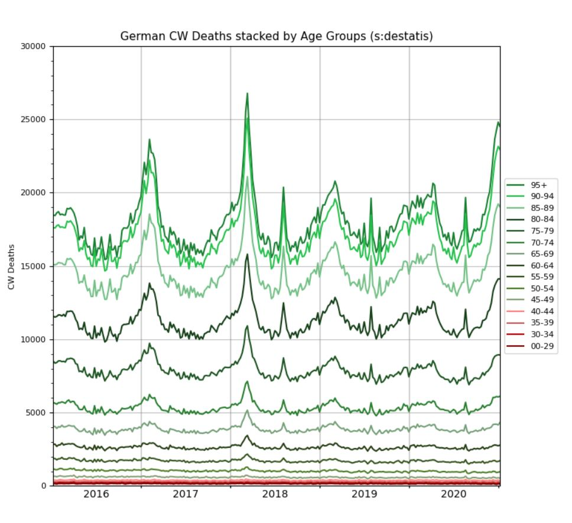

# AgeGroup-based-Death-Monitoring

### Can we predict German death waves?? Let's find out.
Hi all fellow hobby-epidemiologists,

this analysis delves into German deaths based on data by [destatis](https://www.destatis.de/DE/Themen/Gesellschaft-Umwelt/Bevoelkerung/Sterbefaelle-Lebenserwartung/Tabellen/sonderauswertung-sterbefaelle.html;jsessionid=D5059F400B46230E5778173BD23E8094.internet712). Let's find out, if we can predict German deaths by treating viruses as black-box model and predict seasonal death-waves only from past observations (death and population distributions). So we don't care about the virus classification schemes like flu A/B or Corona. We also don't care about DNA, the infectiousness or dangerousness of viruses. The only prior information, we may incorporate is that virus-waves emerge during winter and heat-waves occur during summer. The virus-season starts every year in the beginning of October and ends in the end of May (see RKI). The rest of the year will be denoted as heat-season.

### Let's start by plotting annual deaths decomposed into Age Groups
We start by decomposing the total death signal into age groups. Look at the first plot and try to find your age group. Can you see any waves in your age group? No?,.. then you probably belong to a younger age group. Yes!, then you belong definitely to an older age group. And this our first observation: Old people cause seasonality in deaths and young people don't. Let's re-check this for each year. Whatever year we look at, the pattern remains the same: Below age 45 age-bands remain flat (non-seasonal age groups) while above 45 age-bands start to form waves (seasonal age groups). This is true for virus waves and heat waves. 
 
 Other than this what can we see? Anything remarkable or even "novel" for e.g. 2020? Hmm, it looks like there are sometimes waves with heavy spikes during winter and in other seasons only mild waves. These changes in amplitudes and frequency are also true for heat waves. In some years heat waves occur, in others almost non-existent. Moreover, we see that that some virus waves start earlier like 20/21 and other take off late like in 17/18. In signal analysis this is called a phase-shift. Looking at number of waves during each season, there seems to be only one spike for the winter seasons. To sum things up a bit, there seems to be no simple and clear pattern to predict, whether a wave will be heavy or mild. We only know so far, waves will occur at different times. Therefore to expect Excess Deaths during each winter season is normal (It's just a phase-shift) and waves are only related to older age groups. 
 
 ### Prediction of Heat Waves?
 Let's check the reason for heat waves real quick. Ok, as the name "heat" implies, these waves will obviously occur during hot temperatures. If this is true, there should be maximum values for temperature measurements during these periods. Looking at our plot again, we see summer spikes for years 2018, 2019 and 2020. Looking at Wikipedia confirms that were heat waves in Germany at this time e.g. [2018](https://en.wikipedia.org/wiki/2018_European_heat_wave#Germany), [2019 ](https://en.wikipedia.org/wiki/2019_European_heat_wave#Germany): On 26 June exceeding 35 °C (95 °F), on 25 July, a temperature of 42.6 °C (108.7 °F). Ok nice and easy, we found the reason: Hot temperatures caused by hot air from the south esp. the Sahara desert. How about prediction of these? Unfortunately, this is not easy. Temperatures belong to the weather which is driven by chaotic wind directions. And as we all know, weather forecasts are only good for a couple of days. So there is currently no long-term prediction available. Generally, we may just conclude from global warming and increasing part of older population that these heat-waves will likely occur more often.
 
 
 

 
 
